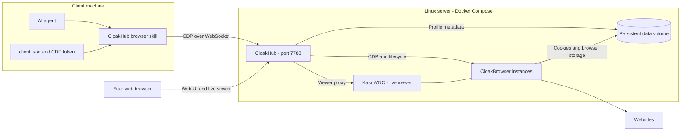

# CloakHub

Run persistent browsers on your own server and let agents use them from another machine.
CloakHub manages [CloakBrowser](https://github.com/CloakHQ/CloakBrowser) profiles with
saved logins, a live browser viewer, and remote automation. Idle browsers stop to free
resources and wake when you connect again; their profile data stays on disk.

- **Persistent identities:** each profile keeps cookies, storage, fingerprint settings, and proxy configuration.
- **On-demand browsers:** automatic wake-up, configurable idle sleep, and a running-instance limit.
- **Human and agent access:** use the web viewer for login or manual work and the companion skill for automation.
- **Simple deployment:** Docker Compose on Linux, with amd64 and arm64 images.

## How it works



The server runs the browsers. The client runs the agent and a small Node/Playwright
script supplied by the skill; it needs no local browser, browser license, or MCP server.
A client target alias selects the hub URL, exact profile ID, and profile CDP token together.

## Docker

You need a Linux host with Docker Compose and a CloakBrowser key that permits the
selected browser build. No source checkout or local image build is required. Create
a deployment directory and save this as `compose.yml` (also available [here](compose.yml)):

```yaml
services:
  cloakhub:
    image: ghcr.io/txchen/cloakhub:0.7.0
    restart: unless-stopped
    shm_size: 2gb
    environment:
      CLOAKHUB_LICENSE_KEYS_FILE: /run/secrets/cloakbrowser-keys
      CLOAKHUB_DATA_DIR: /data
      CLOAKHUB_HOST: 0.0.0.0
      CLOAKHUB_PORT: "7788"
      CLOAKHUB_DISK_CACHE_SIZE_MB: "${CLOAKHUB_DISK_CACHE_SIZE_MB:-256}"
      CLOAKHUB_DEFAULT_TIMEZONE: "${CLOAKHUB_DEFAULT_TIMEZONE:-UTC}"
      CLOAKHUB_DEFAULT_LOCALE: "${CLOAKHUB_DEFAULT_LOCALE:-en-US}"
      CLOAKHUB_AUTH_TOKEN: "${CLOAKHUB_AUTH_TOKEN:?Set CLOAKHUB_AUTH_TOKEN in .env}"
    ports:
      - "${CLOAKHUB_BIND_ADDRESS:-127.0.0.1}:7788:7788"
    volumes:
      - ./data:/data
      - ./secrets/cloakbrowser-keys:/run/secrets/cloakbrowser-keys:ro
```

Create `.env` beside it, replacing the admin password with a value generated by
`openssl rand -hex 32`. The following example allows access from your private LAN:

```dotenv
CLOAKHUB_AUTH_TOKEN=replace-with-a-random-admin-password
CLOAKHUB_BIND_ADDRESS=0.0.0.0
CLOAKHUB_DEFAULT_TIMEZONE=America/Los_Angeles
CLOAKHUB_DEFAULT_LOCALE=en-US
```

Choose the timezone and locale for your browser's internet exit. Omit
`CLOAKHUB_BIND_ADDRESS` to bind only to server localhost, for example behind a local
reverse proxy. For internet access, use HTTPS and a proxy supporting WebSocket upgrades.
Set `X-Forwarded-Host` and `X-Forwarded-Proto` to the public origin and overwrite
client-supplied forwarded headers. Mount CloakHub at the origin root, not a path prefix.

Prepare storage, then create `secrets/cloakbrowser-keys` with one CloakBrowser key per line:

```sh
mkdir -p secrets data
chmod 700 secrets
# Save your key(s) in secrets/cloakbrowser-keys, then:
chmod 600 .env secrets/cloakbrowser-keys
docker compose pull
docker compose up -d
docker compose logs -f cloakhub
```

Open `http://<server-lan-ip>:7788` (or your HTTPS origin) and sign in with the admin
password. With localhost binding, open `http://localhost:7788` on the server or use
your reverse proxy. The image automatically selects amd64 or arm64.

On first start, the server downloads and verifies the pinned browser and caches it in
`./data/browser-cache`. Version `0.7.0` uses preview **152.0.7977.82.1**, includes Mac
fonts, and defaults new profiles to a macOS identity. No browser binary or license key
is bundled in the image. Keep `./data` across container replacements: it contains
profile metadata, browser storage, and secrets. See [browser builds](docs/private-macos.md)
and the [preview/stable comparison](docs/browser-channel-comparison.md) for details.

## Prepare a browser profile

1. Create a profile in the web UI with an exact ID such as `research`.
2. Open its viewer and sign into any websites the agent should use. Default headed
   mode supports unattended automation; you do not need to leave the viewer open.
3. Generate and copy the profile's **CDP token** from its controls.
4. Give the client the hub origin, profile ID, and that CDP token.

There are three separate credentials:

| Credential | Where it belongs | Purpose |
| --- | --- | --- |
| CloakBrowser key | Server secret file | Download and run the browser |
| CloakHub admin password | Operator / management API | Manage profiles and the server UI |
| Profile CDP token | Client secret file or environment | Operate one profile's browser |

The agent needs only the profile CDP token. An admin password does not replace it.
A profile without a CDP token has **unprotected CDP endpoints**, even when admin
authentication is enabled.

## Install the agent skill

On the **client machine**, install Node.js 20+ and run:

```sh
npx skills add txchen/cloakhub --skill cloakhub-browser --global
```

Select your agent clients and the default symlink installation mode when prompted.
The global skill directory is normally `~/.agents/skills/cloakhub-browser` in that mode.
Install its pinned Node dependency there:

```sh
npm ci --prefix "$HOME/.agents/skills/cloakhub-browser"
```

If you choose copy mode or a different installation location, use the directory
printed by the installer instead. Reload your agent's skills or restart its session.
The [skills CLI](https://github.com/vercel-labs/skills#readme) installs the skill files;
`npm ci` installs `playwright-core` without downloading a local browser. After a skill
update, run `npm ci` in the installed directory again.

## Configure the client

Create the client configuration directory:

```sh
mkdir -p "$HOME/.config/cloakhub/tokens"
chmod 700 "$HOME/.config/cloakhub" "$HOME/.config/cloakhub/tokens"
```

Save this as `~/.config/cloakhub/client.json`, replacing the example origin and
profile ID with yours:

```json
{
  "version": 1,
  "defaultTarget": "work",
  "targets": {
    "work": {
      "url": "http://192.168.1.50:7788",
      "profile": "research",
      "tokenFile": "tokens/work"
    }
  }
}
```

Save only the profile's CDP token in `~/.config/cloakhub/tokens/work`, then restrict
its permissions:

```sh
chmod 600 "$HOME/.config/cloakhub/tokens/work"
```

`work` is a client-local alias; `research` is the exact server profile ID, not its
display name. `url` is the hub origin without `/api/...`. Relative token paths are
resolved beside `client.json`, so `tokens/work` needs no machine-specific path.
The helper reads the token directly; keep it out of prompts and committed files.

For multiple profiles or servers, add entries under `targets`, each with its own
`url`, `profile`, and credential. The same skill works for all of them:

- No explicit selection: use `defaultTarget`.
- A request such as “use the personal browser”: the agent passes `--target personal`.
- `CLOAKHUB_TARGET=work` in the agent's execution environment overrides the default;
  explicit `--target` takes precedence over both.
- `CLOAKHUB_CLIENT_CONFIG` selects a different config file. No project-local config
  is automatically loaded.

For an environment-managed secret, replace `tokenFile` with
`"tokenEnv": "WORK_CLOAKHUB_CDP_TOKEN"` and provide that variable to the agent's process.
Missing configuration or credentials cause an error; the helper does not choose an
arbitrary profile or fall back to a local browser.

Verify the setup:

```sh
node "$HOME/.agents/skills/cloakhub-browser/scripts/browser.mjs" targets
node "$HOME/.agents/skills/cloakhub-browser/scripts/browser.mjs" check --target work
```

`targets` lists local connection metadata without reading tokens or contacting the
server. `check` makes an authenticated CDP connection, wakes the profile if needed,
reports `"ok": true`, and disconnects. Then ask your agent, for example:

> Use the CloakHub work browser to open example.com and tell me the page title.

See the [skill](skills/cloakhub-browser/SKILL.md) for the browser workflow and
[client setup reference](skills/cloakhub-browser/references/setup.md) for troubleshooting.

## Use any CDP client

CloakHub exposes standard Chrome DevTools Protocol (CDP) endpoints. Existing
CDP-based tools such as Playwright and Puppeteer can connect directly: point their
remote-browser connection at your profile's endpoint and, if configured, supply its CDP token.
No CloakHub SDK, agent skill, or admin credential is required for browser operations.

For example, install Playwright's client library on your client machine:

```sh
npm install playwright-core
```

Save this as `browse.mjs`. Replace the example origin and profile ID. If the profile
has a CDP token, provide it through `CLOAKHUB_CDP_TOKEN`; otherwise leave that variable
unset. Omitting the client token does not bypass a token configured on the server.
This example opens [Device & Browser Info's bot test](https://deviceandbrowserinfo.com/are_you_a_bot),
prints its detection results, and saves a screenshot on the client:

```js
import { chromium } from 'playwright-core';

const token = process.env.CLOAKHUB_CDP_TOKEN;

const browser = await chromium.connectOverCDP(
  'https://browser.example.com/api/profiles/research/cdp',
  {
    headers: token ? { Authorization: `Bearer ${token}` } : {},
    timeout: 60_000 // Allow time to wake a stopped browser.
  }
);

try {
  const context = browser.contexts()[0]; // Reuse the profile's saved login state.
  const page = await context.newPage();
  try {
    await page.goto('https://deviceandbrowserinfo.com/are_you_a_bot', {
      waitUntil: 'domcontentloaded', timeout: 60_000
    });
    // Wait for the site's asynchronous report, not just the initial page load.
    const report = page.locator('#jsonResult').filter({ hasText: /"isBot"\s*:/ });
    await report.waitFor({ state: 'visible', timeout: 60_000 });
    console.log(JSON.stringify(JSON.parse(await report.innerText()), null, 2));
    await page.screenshot({ path: 'bot-detection.png', fullPage: true });
  } finally {
    await page.close(); // Close only the tab this script created.
  }
} finally {
  await browser.close(); // Playwright disconnects this remote CDP client.
}
```

Run `node browse.mjs` (with the token in its environment if required). The connection
automatically starts a stopped profile; no separate launch request is needed.
Clients accepting a WebSocket endpoint can use
`wss://browser.example.com/api/profiles/research/cdp` with the same authorization
header. For a private HTTP deployment, use `http://` / `ws://` instead.

Inspect the site's `isBot` verdict and signals such as `isAutomatedWithCDP`,
`isAutomatedWithCDPInWebWorker`, `isPlaywright`, and `hasWebdriverTrue`. A `true`
detection signal means that particular check flagged the browser. This test covers
fingerprinting signals, not IP reputation or user behavior; passing it is not a
guarantee against detection on other sites. Results depend on the browser build,
profile settings, automation client, and the site's current checks. If the report
times out, treat the test as incomplete, not as a pass; the site's DOM may also change.

Disconnect when finished so idle shutdown can reclaim resources. Reconnect through
the same fixed profile URL after a stop or restart; existing connections and in-flight
commands are not automatically resumed. Compatibility follows each library's CDP
support; CloakHub does not implement Playwright's separate browser-server protocol.
See the [API guide](docs/api.md#cdp-endpoints) for discovery and authentication details.

## Everyday use

Select a profile in the sidebar to open its viewer or controls. Use its menu to edit
settings, manage its token, or start/stop it. **Close viewer** disconnects the viewer
only. The event log shows starts, failures, idle stops, and capacity events.

Browsers wake automatically through their fixed profile connection URL. The skill
disconnects after each script so idle sleep can work. An open CDP connection prevents
automatic sleep; simply watching the viewer does not. Sleep retains browser storage
and restores tabs, but does not preserve live JavaScript or unfinished operations.

Multiple clients using the same profile share tabs and login state; aliases do not
provide task isolation. Coordinate access or assign separate profiles for parallel work.
Explicit Stop/Restart disconnects every client. Delete removes the profile's stored data.
Launch-setting edits apply on the next start; deployment defaults affect new profiles only.
Automatic GeoIP and SDK Humanize are not provided by this runtime.

## Server settings and upgrades

Common settings can be added under `environment` in Compose. Only variables explicitly
referenced by `compose.yml` are picked up from `.env`.

| Setting | Default / purpose |
| --- | --- |
| `CLOAKHUB_MAX_RUNNING_INSTANCES` | `10`; browser key quotas may lower the effective limit |
| `CLOAKHUB_DEFAULT_PLATFORM` | `macos` in Docker; `linux` in source runs without an override |
| `CLOAKHUB_DEFAULT_TIMEZONE` / `CLOAKHUB_DEFAULT_LOCALE` | Compose uses `UTC` / `en-US`; set these to your region |
| `CLOAKHUB_DISK_CACHE_SIZE_MB` | `256` per profile; HTTP cache budget, not a profile disk quota |
| `CLOAKHUB_BROWSER_VERSION` / `CLOAKHUB_BROWSER_CHANNEL` | Exact build and channel; Docker pins `152.0.7977.82.1` / `preview` |
| `CLOAKHUB_BROWSER_BIN` | Optional mounted binary, overriding the downloader |
| `CLOAKHUB_LICENSE_KEYS_FILE` | Browser keys; see [multiple-key configuration](docs/cloakbrowser-151.md#configure-keys) |

Pin a full image tag such as `0.7.0` for predictable upgrades. The `0.7` alias follows
patch releases; `latest` follows releases, and `master` / `sha-*` are development tags.
Browser builds stay pinned until you change the selected build or image.

Before upgrading, stop the service with `docker compose stop` and back up the entire
`./data` directory while browsers are stopped. Update the image tag, then run
`docker compose pull` and `docker compose up -d`. Retain the old image tag and backup
for rollback; do not assume older browsers can read profiles upgraded by newer builds.

## Further documentation

- [Automation API](docs/api.md) and [management script example](examples/agent-workflow.mjs)
- [Client setup and troubleshooting](skills/cloakhub-browser/references/setup.md)
- [Mac fonts and image builds](docs/private-macos.md)
- [152 preview versus 151 stable](docs/browser-channel-comparison.md)
- [Browser keys, concurrency, and historical 151 migration](docs/cloakbrowser-151.md)
- [Development and tests](docs/development.md)
