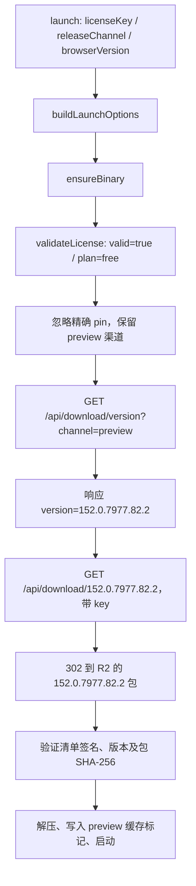

# CloakBrowser 0.5.11 下载流程与 154 问题定位

> **2026-09-30 21:10 PDT 更新：同一 key、同一 SDK 0.5.11 已成功下载、验证并启动 154。** 官方渠道查询现在返回 preview=154.0.8037.57.1、stable=152.0.7977.82.2；没有修改 SDK 或升级 key。下文记录的是 9 月 29 日返回旧版本时的代码与网络行为，不代表当前下载状态。

核查日期：2026-09-29，SDK 实际请求跟踪时间 16:19 UTC。

## 结论

SDK 的 preview 参数正确到达版本查询接口。当前阻断点在版本发现阶段：官方 `/api/download/version?channel=preview` 实际返回 `152.0.7977.82.2`，SDK 随后按这个版本请求下载，未出现“先收到 154、再被 SDK 降为 152”的过程。

同时发现一个明确的客户端行为：key 的 plan 为 free 时，SDK 主动删除精确版本 pin。这解释了为何传入 `browserVersion: '154.0.8037.57.1'` 不能强制选择 154，但不能单独解释无 pin preview 的渠道元数据为何仍为 152。

## 调用链

检查的是本机隔离安装的 npm `cloakbrowser@0.5.11`，其代码位于 `.cloakhub/cloak154-evaluation/wrapper-0511/node_modules/cloakbrowser/dist/`。



### 1. launch 没有把渠道吃掉

`playwright.js:91` 将三个参数原样传给 `ensureBinary(options.licenseKey, options.browserVersion, options.releaseChannel)`。`config.js:62` 的渠道优先级为：显式参数 → `CLOAKBROWSER_RELEASE_CHANNEL` → stable；preview 会被规范化后保留。

### 2. 免费 key 的 pin 被主动清除

`download.js:71`：

```js
const proVersion = info.plan === "free" ? undefined : requestedVersion;
return await ensureProBinary(effectiveKey, proVersion, info.plan, releaseChannel);
```

`releaseChannel` 仍传入，只清除精确版本。这个判断使用真实授权验证结果；本次新缓存请求返回 `valid=true, plan=free`。没有修改授权结果或伪造 plan。

### 3. 最新版本来自服务端，不来自 SDK 内置常量或发布清单

`license.js:441` 的 `getProLatestRelease()` 请求：

```text
GET https://cloakbrowser.dev/api/download/version?channel=preview
X-Platform: linux-x64
```

这个版本查询不携带 key。SDK 直接取响应的 `version`，不会遍历 release 目录，也不会因为发现 154 的签名清单就自动选择 154。

SDK 中 `PRO_MAJOR = "152"` 仅用于欢迎信息；`CHROMIUM_VERSION = "146..."` 用于无 key 的旧版公开包路径。它们不是本次有效 key 路径选择 152 的依据。

### 4. 真正下载时不再传 channel

`download.js:753` 的 `downloadProBinary(version, licenseKey)` 请求：

```text
GET https://cloakbrowser.dev/api/download/{查询得到的版本}
Authorization: Bearer <key>
X-Platform: linux-x64
```

这里没有 `?channel=preview`，也不直接调用 `/api/download/latest?channel=preview`；SDK 的设计是先把 channel 解析为精确版本，再获取该版本。`downloadFile()` 使用 `redirect: "follow"` 跟随服务器的签名 R2 链接。

这处“下载请求不带 channel”容易被怀疑为问题，但不能仅凭这一点判定为 bug：本次收到的版本号本来就是 .82.2，实际下载也正确给出了 .82.2。此前手动请求 `/api/download/154.0.8037.57.1?channel=preview` 和 `/api/download/latest?channel=preview` 同样返回 .82.2，因此补上这个参数并未得到 154。

### 5. 校验阶段不会静默把旧包冒充新包

`download.js:795` 起的 `verifyProDownload()` 获取所选版本的 `SHA256SUMS` 和 `.sig`，依次验证固定公钥签名、清单声明版本、平台文件条目、包 SHA-256。官方路径不能通过 `CLOAKBROWSER_SKIP_CHECKSUM` 跳过这些检查。

因此直接走内部下载函数强求 154 时，服务器若给出旧包，就会发生之前记录的 hash mismatch；这与正常 free-key 路径先忽略 pin 是两种不同现象。

## 实际 SDK 请求跟踪

使用全新缓存，对原版 SDK 的 `fetch` 做仅观察的包装：授权和版本响应原样返回；到归档请求时真实访问官方下载入口，记录 302 的目标路径后停止，不再重复下载 223 MB。不修改版本响应、key、授权结果或 SDK 文件。这个实验验证版本选择和请求流程，完整包校验/启动结果见主报告此前的实际 launch 实验。

| SDK 输入 | key 验证 | 版本查询实际返回 | SDK 真正请求 | 服务器重定向 |
| --- | --- | --- | --- | --- |
| preview，无 pin | valid / free | 152.0.7977.82.2 | `/api/download/152.0.7977.82.2` | .82.2 包 |
| preview，pin=154.0.8037.57.1 | valid / free | 152.0.7977.82.2 | `/api/download/152.0.7977.82.2` | .82.2 包 |
| stable，无 pin | valid / free | 152.0.7977.82.1 | `/api/download/152.0.7977.82.1` | .82.1 包 |

三种请求均携带正确 `X-Platform: linux-x64`；真正下载请求带 Authorization。授权验证接口的 key 放在请求 body，因此其 `hasAuthorization=false` 不代表未提供 key。

## 缓存与回退检查

- key 验证缓存为 24 小时；版本查询缓存为 1 小时。
- stable 与 preview 使用不同版本标记和查询缓存文件，按平台分开。
- `CLOAKBROWSER_AUTO_UPDATE=false` 且已有对应可执行文件时可跳过查询；新缓存没有这个条件。
- 查询失败或下载出现瞬时故障时可使用已缓存版本；签名/hash 错误不会这样回退。
- 本轮三组跟踪都是新目录，直接看到了授权查询、版本查询和下载请求，因此不是上述缓存/回退分支导致的结果。

## 能确认与仍不能确认的部分

可以确认：版本在官方查询接口响应时已经是 152；SDK 没有漏传 preview，也没有在收到 154 后擅自降级；free key 的 pin 确实被客户端忽略。

不能确认：服务端是渠道配置、缓存、分阶段发布还是其他条件导致返回旧版本。SDK 仓库没有这部分私有服务端实现，不能凭客户端源码锁定服务端具体根因。不能从本次结果推导付费 key 也无法直接取得已存在的 154 包。

本轮没有需要修改本项目的下载代码；没有修改安装包。跟踪脚本与脱敏结果保留在 `.cloakhub/cloak154-evaluation/distribution-debug/sdk-trace.mjs`、`sdk-trace-preview.json`、`sdk-trace-preview-pin.json`、`sdk-trace-stable.json`。未启动浏览器或占用运行会话。
